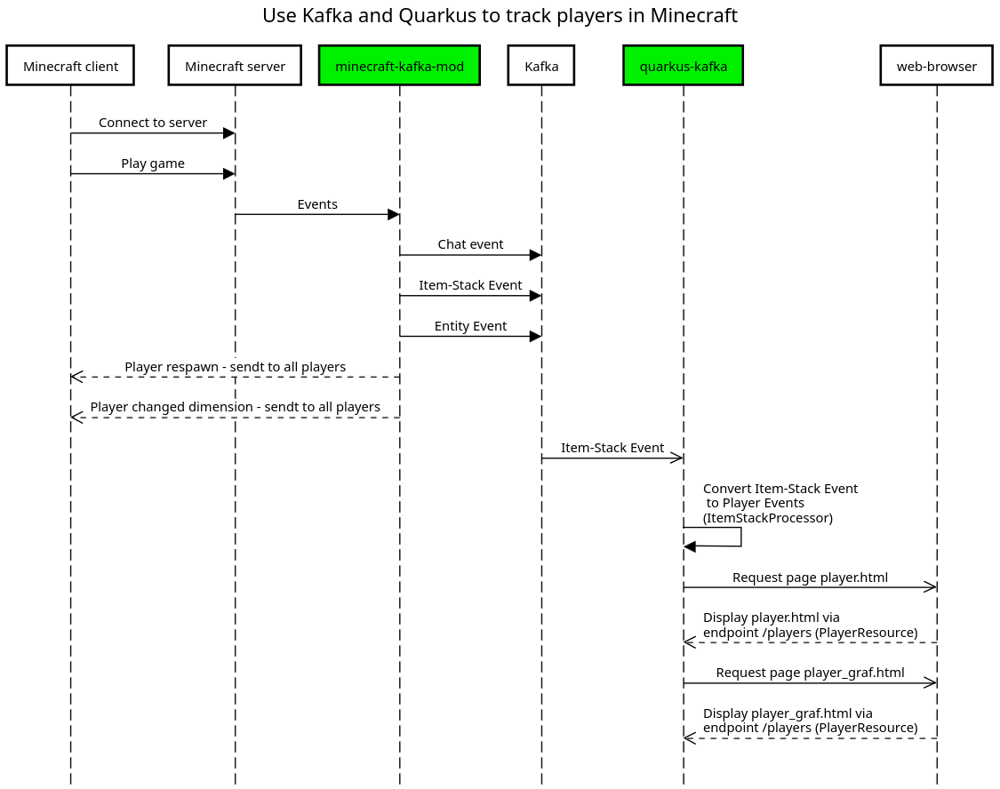
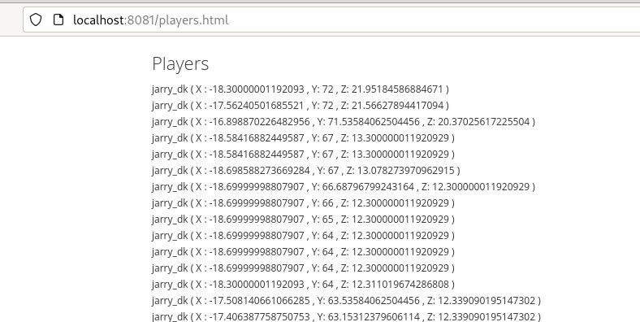
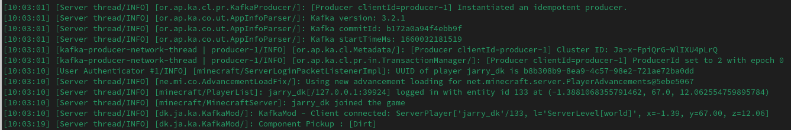

= Use Kafka and Quarkus to track players in Minecraft

This project is created to show how to track events including players movement in Minecraft via Kafka and Quarkus.

.Full flow (Minecraft client, Minecraft server via Kafka and Quarkus to the browser)

.The page player.html in a browser

.Part of the log when Minecraft spins up with the mod `kafkamod` installed

The Minecraft mod `kafkamod` might be a bit to chatty, but it is nice doing development.

TIP: Start Kafka before starting the Minecraft server.

NOTE: I have some issues with `legacyClassPath` and fix it by running the `kafkamod` directly on a forge Minecraft server.

Inspiration: https://github.com/holly-cummins/quarkus-minecraft-observability-extension

== Requeriments

- https://kafka.apache.org[Kafka]
- https://files.minecraftforge.net/net/minecraftforge/forge/[Minecraft Forge]

== Minecraft Kafka mod

The `kafkamod` send a record to Kafka when a player chat, pick up an item, craft an item, a new Entity join the world or a Entity leave the world.

.Record sendt to Kafka when a player chat (topic : kafka-mod-chat)

[source,json]
----
{
    "player": {
        "ipAddress": "127.0.0.1",
        "name": "jarry_dk",
        "x": -1.3881068355791462,
        "y": 67.0,
        "z": 12.062554759895784
    },
    "message": "From MineCraft"
}
----

.Record sendt to Kafka when crafting an item (topic : kafka-mod-item-stack)

[source,json]
----
{
    "displayName": "Spruce Planks",
    "player": {
        "name": "jarry_dk",
        "ipAddress": "127.0.0.1",
        "x": -1.3881068355791462,
        "y": 67.0,
        "z": 12.062554759895784
    },
    "typeOfEvent": "Crafted"
}
----

.Record sendt to Kafka when picking up an item (topic : kafka-mod-item-stack)

[source,json]
----
{
  "displayName": "Stick",
  "player": {
    "ipAddress": "127.0.0.1",
    "name": "jarry_dk",
    "x": -112.14733596516719,
    "y": -34.89135238400638,
    "z": -34.89135238400638
  },
  "typeOfEvent": "Pickup"
}
----

.Record sendt to Kafka when an Entity join the world (topic : kafka-mod-entity-event)

[source,json]
----
{
  "event": "EntityJoinLevelEvent",
  "name": "Falling Block",
  "x": -130.5,
  "y": 62.0,
  "z": 191.5
}

----

.Record sendt to Kafka when an Entity leave the world (topic : kafka-mod-entity-event)

[source,json]
----
{
  "event": "EntityLeaveLevelEvent",
  "name": "Falling Block",
  "x": -130.5,
  "y": 62.0,
  "z": 191.5
}
----

== Quarkus Kafka

The class `ItemStackProcessor` gets records from Kafka, extract the player and send it to `players`.

[source,java]
----
@Incoming("item-stack")
@Outgoing("players")
public Player process(String itemStack) throws InterruptedException {
    Player player = null;
    try {
        JsonNode itemStackObj = objectMapper.readTree(itemStack);
        JsonNode playerObj  = itemStackObj.get("player");
        player = new Player(playerObj);
    } catch (Exception e) {
        e.printStackTrace();
    }
    return player;
}
----

The class `PlayerResource` expose a `text/event-stream` endpoint for all updates to `players`.

Starting the app we are now able to use http://localhost:8081/players.html if in `dev` mode to see updates to players.

== Kafka tasks

.Export KAFKA_HOME

[source,bash]
----
export KAFKA_HOME=/opt/apache/kafka/kafka_2.13-3.4.0
----

.Start Zookeeper

[source,bash]
----
$KAFKA_HOME/bin/zookeeper-server-start.sh $KAFKA_HOME/config/zookeeper.propertie
----

.Start Kafka

[source,bash]
----
$KAFKA_HOME/bin/kafka-server-start.sh $KAFKA_HOME/config/server.properties
----

TIP: Add ` | jq` to get the json from the topic in a nice format. How to install https://stedolan.github.io/jq/[jq].

.Consume the kafka-mod-chat topic
[source,bash]
----
$KAFKA_HOME/bin/kafka-console-consumer.sh \
    --bootstrap-server localhost:9092 \
    --topic kafka-mod-chat \
    --from-beginning
----

.Consume the kafka-mod-item-stack topic
[source,bash]
----
$KAFKA_HOME/bin/kafka-console-consumer.sh \
    --bootstrap-server localhost:9092 \
    --topic kafka-mod-item-stack \
    --from-beginning
----

.Consume the kafka-mod-entity-event topic
[source,bash]
----
$KAFKA_HOME/bin/kafka-console-consumer.sh \
    --bootstrap-server localhost:9092 \
    --topic kafka-mod-entity-event \
    --from-beginning
----

.Create the topic kafka-mod-entity-event (if needed)

[source,bash]
----
$KAFKA_HOME/bin/kafka-topics.sh \
    --bootstrap-server localhost:9092 \
    --topic kafka-mod-entity-event \
    --create
----

.Create the topic kafka-mod-entity-event - adv. #1 (if needed)

[source,bash]
----
$KAFKA_HOME/bin/kafka-topics.sh \
    --bootstrap-server localhost:9092 \
    --topic kafka-mod-entity-event \
    --replica-assignment 0:1:2,0:1:2,0:1:2 \
    --create
----

.Create the topic kafka-mod-entity-event - adv. #2 (if needed)

[source,bash]
----
$KAFKA_HOME/bin/kafka-topics.sh \
    --bootstrap-server localhost:9092 \
    --topic kafka-mod-entity-event \
    --replication-factor 2 \
    --create
----

.Discribe the topic kafka-mod-entity-event

[source,bash]
----
$KAFKA_HOME/bin/kafka-topics.sh \
    --bootstrap-server localhost:9092 \
    --topic kafka-mod-entity-event \
    --describe
----

.Modify the topic kafka-mod-entity-event - change partitions

[source,bash]
----
$KAFKA_HOME/bin/kafka-topics.sh \
    --bootstrap-server localhost:9092 \
    --topic kafka-mod-entity-event \
    --partitions 3 \
    --alter
----

NOTE: This can be done with kafka-reassign-partitions.sh too.

.Delete the topic kafka-mod-entity-event

[source,bash]
----
$KAFKA_HOME/bin/kafka-topics.sh \
    --bootstrap-server localhost:9092 \
    --topic kafka-mod-entity-event \
    --delete
----

.Increasing replication factor for the topic kafka-mod-entity-event

[source,bash]
----
cat > increase-replication-factor.json << EOF
{
    "version": 1,
    "partitions": [
        {
            "topic": "kafka-mod-entity-event",
            "partition": 0,
            "replicas": [
                0,
                1
            ],
            "replication-factor" : 2
        }
    ]
}
EOF
----

[source,bash]
----
$KAFKA_HOME/bin/kafka-reassign-partitions.sh \
    --bootstrap-server localhost:9092 \
    --reassignment-json-file increase-replication-factor.json \
    --execute
----

Source : https://kafka.apache.org/documentation/#basic_ops_increase_replication_factor

== Fixing legacyClassPath (deprecated)

After the build start using https://github.com/johnrengelman/shadow[Gradle Shadow] the need to `Fixing legacyClassPath` has `vanish into thin air`

What is https://github.com/johnrengelman/shadow[Gradle Shadow] ?

[quote]
Gradle plugin for creating fat/uber JARs with support for package relocation.

If you not not like to create a fat/uber JAR - please proceed...

Open this file `/opt/minecraft/forge/.minecraft_1.19.4-45.0.49/libraries/net/minecraftforge/forge/1.19.4-45.0.49/unix_args.txt` and append this to `-DlegacyClassPath=`

NOTE: This only works for `Linux`

----
:mods/kafka-clients-3.4.0.jar:mods/lz4-java-1.8.0.jar:mods/snappy-java-1.1.8.4.jar:mods/zstd-jni-1.5.2-1.jar:mods/jackson-databind-2.14.2.jar:mods/jackson-annotations-2.14.2.jar:mods/jackson-core-2.14.2.jar
----

We do need to add the jar files to the folder `/opt/minecraft/forge/.minecraft_1.19.4-45.0.49/mods` - I use the script link:minecraft-kafka-mod/deploy.sh[deploy.sh]

.Download mod dependencies
[source,bash]
----
cd minecraft-kafka-mod
./dependencies_download.sh
----
Source - link:minecraft-kafka-mod/dependencies_download.sh[minecraft-kafka-mod/dependencies_download.sh]

.Deplay dependencies in mods folder of forge
[source,bash]
----
cd minecraft-kafka-mod
./deploy.sh
----
Source - link:minecraft-kafka-mod/deploy.sh[minecraft-kafka-mod/deploy.sh]

Included in this project is my link:unix_args.txt[unix_args.txt] file.

NOTE: https://github.com/holly-cummins[Holly Cummins] do not have this issue in her project https://github.com/holly-cummins/quarkus-minecraft-observability-extension where she use undertow, servlet and jaxrs!
----
 implementation 'javax.ws.rs:javax.ws.rs-api:2.0.1'
 implementation 'org.jboss.resteasy:resteasy-jaxrs:4.0.0.Beta5'
 implementation 'org.jboss.resteasy:resteasy-undertow:4.0.0.Beta5'
 implementation 'javax.servlet:javax.servlet-api:3.0.1'
 implementation 'io.undertow:undertow-core:2.2.17.Final'
----

== Links

- https://files.minecraftforge.net/net/minecraftforge/forge/[Downloads for Minecraft Forge]
- https://docs.minecraftforge.net/en/latest/[MinecraftForge Documentation]
- https://nekoyue.github.io/ForgeJavaDocs-NG/javadoc/1.19.1/index.html
- https://quarkus.io/guides/kafka-reactive-getting-started[Getting Started to SmallRye Reactive Messaging with Apache Kafka - Quarkus]
- https://threejs.org
- https://stedolan.github.io/jq/
- https://sequencediagram.org/

=== Kafka links

- https://kafka.apache.org/32/javadoc/index-all.html
- https://kafka.apache.org/32/javadoc/org/apache/kafka/clients/producer/KafkaProducer.html
- https://kafka.apache.org/32/javadoc/org/apache/kafka/clients/consumer/KafkaConsumer.html
- https://github.com/confluentinc/examples/tree/7.2.1-post/clients/cloud/java/src/main/java/io/confluent/examples/clients/cloud
- https://hevodata.com/learn/kafka-replication/
- https://medium.com/@_amanarora/replication-in-kafka-58b39e91b64e
- https://www.confluent.io/blog/hands-free-kafka-replication-a-lesson-in-operational-simplicity/
- https://kafka.apache.org/documentation/#basic_ops_increase_replication_factor
- https://sleeplessbeastie.eu/2022/01/05/how-to-reassign-kafka-topic-partitions-and-replicas/[How to reassign Kafka topic partitions]
