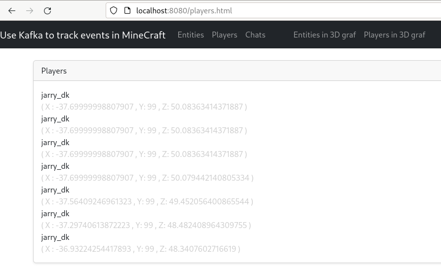

= Use Kafka and Quarkus to track players in Minecraft

This project is created to show how to track events including players movement in Minecraft via Kafka and Quarkus.

.Full flow (Minecraft client, Minecraft server via Kafka and Quarkus to the browser)

.The page player.html in a browser

.Part of the log when Minecraft spins up with the mod `kafkamod` installed
image::images/minecraft_server_start.png[]

The Minecraft mod `kafkamod` might be a bit to chatty, but it is nice doing development.

TIP: Start Kafka before starting the Minecraft server.

Inspiration: https://github.com/holly-cummins/quarkus-minecraft-observability-extension

== Requeriments

- https://kafka.apache.org[Kafka]
- https://files.minecraftforge.net/net/minecraftforge/forge/[Minecraft Forge]

== Minecraft Kafka mod

Minecraft Kafka mod use Apache Kafka to send event about

- Chat
- Entities entring or leaving the world
- Entities crafted or picked up by a player

Jump to link:minecraft-kafka-mod/[code]

== Quarkus Kafka

Jump to link:quarkus-kafka/[code]

The class `ItemStackProcessor` gets records from Kafka, extract the player and send it to `players`.

[source,java]
----
@Incoming("item-stack")
@Outgoing("players")
public Player process(String itemStack) throws InterruptedException {
    Player player = null;
    try {
        JsonNode itemStackObj = objectMapper.readTree(itemStack);
        JsonNode playerObj  = itemStackObj.get("player");
        player = new Player(playerObj);
    } catch (Exception e) {
        e.printStackTrace();
    }
    return player;
}
----

The class `PlayerResource` expose a `text/event-stream` endpoint for all updates to `players`.

Starting the app we are now able to use http://localhost:8081/players.html if in `dev` mode to see updates to players.

== Kafka tasks

.Export KAFKA_HOME

[source,bash]
----
export KAFKA_HOME=/opt/apache/kafka/kafka_2.13-3.5.0
----

.Start Zookeeper

[source,bash]
----
$KAFKA_HOME/bin/zookeeper-server-start.sh $KAFKA_HOME/config/zookeeper.propertie
----

.Start Kafka

[source,bash]
----
$KAFKA_HOME/bin/kafka-server-start.sh $KAFKA_HOME/config/server.properties
----

TIP: Add ` | jq` to get the json from the topic in a nice format. How to install https://stedolan.github.io/jq/[jq].

.Consume the kafka-mod-chat topic
[source,bash]
----
$KAFKA_HOME/bin/kafka-console-consumer.sh \
    --bootstrap-server localhost:9092 \
    --topic kafka-mod-chat \
    --from-beginning
----

.Consume the kafka-mod-item-stack topic
[source,bash]
----
$KAFKA_HOME/bin/kafka-console-consumer.sh \
    --bootstrap-server localhost:9092 \
    --topic kafka-mod-item-stack \
    --from-beginning
----

.Consume the kafka-mod-entity-event topic
[source,bash]
----
$KAFKA_HOME/bin/kafka-console-consumer.sh \
    --bootstrap-server localhost:9092 \
    --topic kafka-mod-entity-event \
    --from-beginning
----

.Consume the kafka-mod-player-event topic
[source,bash]
----
$KAFKA_HOME/bin/kafka-console-consumer.sh \
    --bootstrap-server localhost:9092 \
    --topic kafka-mod-player-event \
    --from-beginning
----

.Create the topic kafka-mod-entity-event (if needed)

[source,bash]
----
$KAFKA_HOME/bin/kafka-topics.sh \
    --bootstrap-server localhost:9092 \
    --topic kafka-mod-entity-event \
    --create
----

.Create the topic kafka-mod-entity-event - adv. #1 (if needed)

[source,bash]
----
$KAFKA_HOME/bin/kafka-topics.sh \
    --bootstrap-server localhost:9092 \
    --topic kafka-mod-entity-event \
    --replica-assignment 0:1:2,0:1:2,0:1:2 \
    --create
----

.Create the topic kafka-mod-entity-event - adv. #2 (if needed)

[source,bash]
----
$KAFKA_HOME/bin/kafka-topics.sh \
    --bootstrap-server localhost:9092 \
    --topic kafka-mod-entity-event \
    --replication-factor 2 \
    --create
----

.Discribe the topic kafka-mod-entity-event

[source,bash]
----
$KAFKA_HOME/bin/kafka-topics.sh \
    --bootstrap-server localhost:9092 \
    --topic kafka-mod-entity-event \
    --describe
----

.Modify the topic kafka-mod-entity-event - change partitions

[source,bash]
----
$KAFKA_HOME/bin/kafka-topics.sh \
    --bootstrap-server localhost:9092 \
    --topic kafka-mod-entity-event \
    --partitions 3 \
    --alter
----

NOTE: This can be done with kafka-reassign-partitions.sh too.

.Delete the topic kafka-mod-entity-event

[source,bash]
----
$KAFKA_HOME/bin/kafka-topics.sh \
    --bootstrap-server localhost:9092 \
    --topic kafka-mod-entity-event \
    --delete
----

.Increasing replication factor for the topic kafka-mod-entity-event

[source,bash]
----
cat > increase-replication-factor.json << EOF
{
    "version": 1,
    "partitions": [
        {
            "topic": "kafka-mod-entity-event",
            "partition": 0,
            "replicas": [
                0,
                1
            ],
            "replication-factor" : 2
        }
    ]
}
EOF
----

[source,bash]
----
$KAFKA_HOME/bin/kafka-reassign-partitions.sh \
    --bootstrap-server localhost:9092 \
    --reassignment-json-file increase-replication-factor.json \
    --execute
----

Source : https://kafka.apache.org/documentation/#basic_ops_increase_replication_factor

== Links

- https://files.minecraftforge.net/net/minecraftforge/forge/[Downloads for Minecraft Forge]
- https://docs.minecraftforge.net/en/latest/[MinecraftForge Documentation]
- https://github.com/MinecraftForge/MinecraftForge[MinecraftForge]
- https://nekoyue.github.io/ForgeJavaDocs-NG/javadoc/1.19.1/index.html
- https://quarkus.io/guides/kafka-reactive-getting-started[Getting Started to SmallRye Reactive Messaging with Apache Kafka - Quarkus]
- https://threejs.org
- https://stedolan.github.io/jq/
- https://sequencediagram.org/

=== Kafka links

- https://kafka.apache.org/32/javadoc/index-all.html
- https://kafka.apache.org/32/javadoc/org/apache/kafka/clients/producer/KafkaProducer.html
- https://kafka.apache.org/32/javadoc/org/apache/kafka/clients/consumer/KafkaConsumer.html
- https://github.com/confluentinc/examples/tree/7.2.1-post/clients/cloud/java/src/main/java/io/confluent/examples/clients/cloud
- https://hevodata.com/learn/kafka-replication/
- https://medium.com/@_amanarora/replication-in-kafka-58b39e91b64e
- https://www.confluent.io/blog/hands-free-kafka-replication-a-lesson-in-operational-simplicity/
- https://kafka.apache.org/documentation/#basic_ops_increase_replication_factor
- https://sleeplessbeastie.eu/2022/01/05/how-to-reassign-kafka-topic-partitions-and-replicas/[How to reassign Kafka topic partitions]
